# SFBot
**Secure Fast ChatBot with INT4 Quantization for `LLaMA-2` Chat Model**

## Introduction
This repository provides a secure and efficient implementation of a chatbot using the `LLaMA-2-7B-chat-hf` model. Key features include:

- **INT4 Quantization**: Reduces model size and accelerates inference while maintaining high performance.
- **Enhanced Security**: Integrates Intel TDX technology to ensure safe deployment and interaction.
- **Optimized Performance**: Leverages IPEX-LLM to enhance the speed and efficiency of the chat model.

## How To

### Overview
The diagram below gives a brief introduction to the ChatBot system.

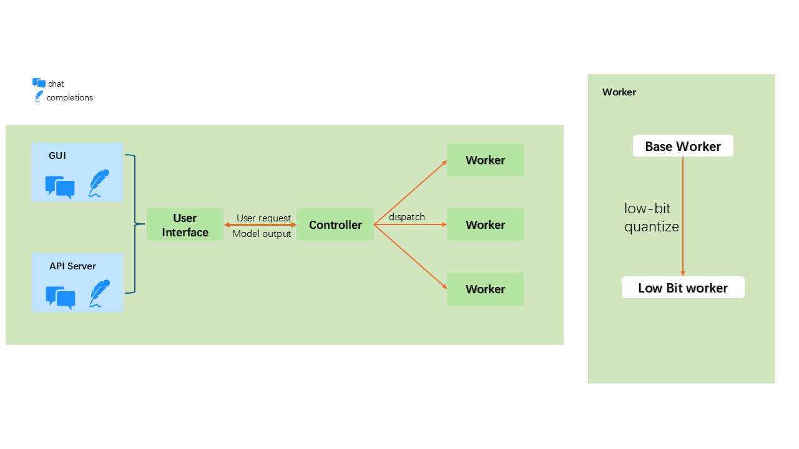

The system is based on [FastChat](https://github.com/lm-sys/FastChat) and has been further developed to support additional features.

### System Development

The system uses FastChat's base worker and GUI, with custom development for a low-bit worker and API server.

### INT4 Low-Bit Quantization
In typical model training, floating-point data formats are used, leading to significant space overhead.

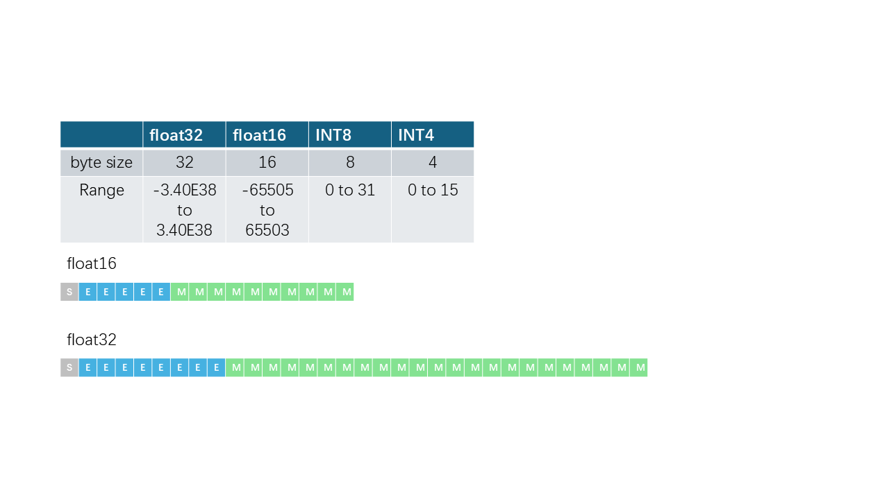

To reduce this overhead, quantization techniques can be employed. In this project, I used INT4 low-bit quantization implemented by GGML, and within the IPEX-LLM project, it was implemented using CPython.

#### Symmetric INT4 Quantization

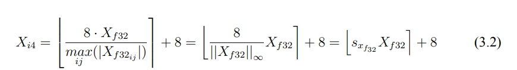

#### Asymmetric INT4 Quantization

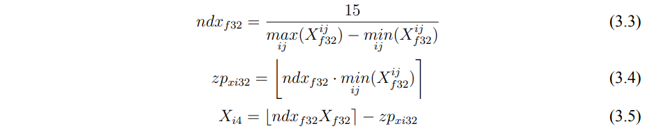

#### Quantization Loss
The following chart shows a comparison between the original and symmetrically quantized INT4 weights of the LLaMA-2-7B model:

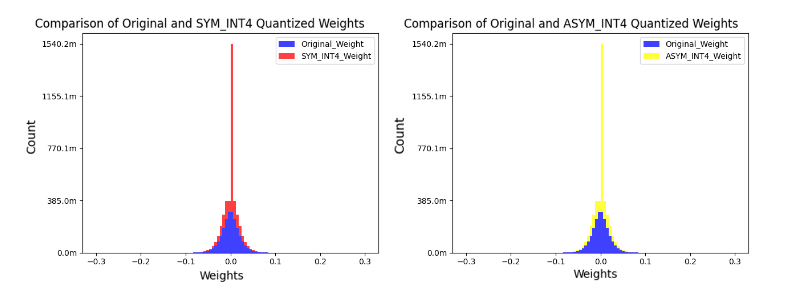

### Cloud Deployment

The system is deployed in the cloud using Docker and Kubernetes.

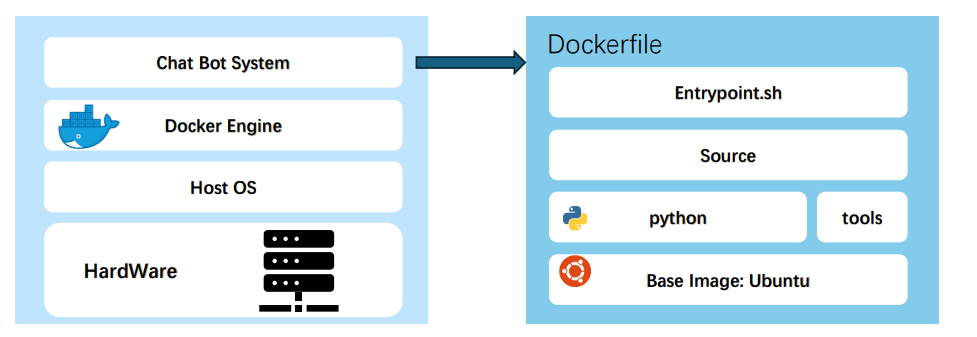

The architecture is illustrated below:

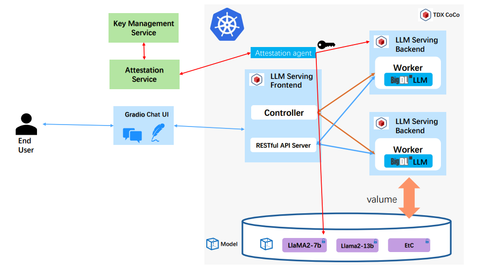

## Demo

### GUI
The system's graphical user interface is shown below:

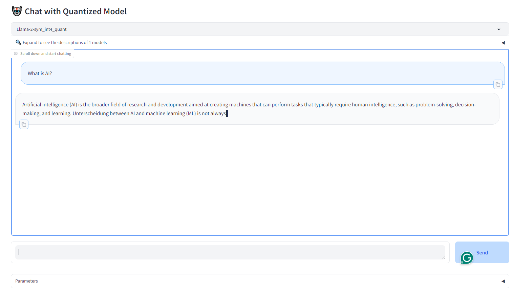

### API Server
Below is the illustration of the API server:

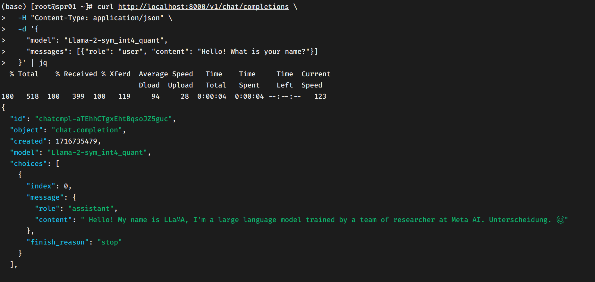

## System Benchmark

### Load Time of Original Model vs. Quantized Model
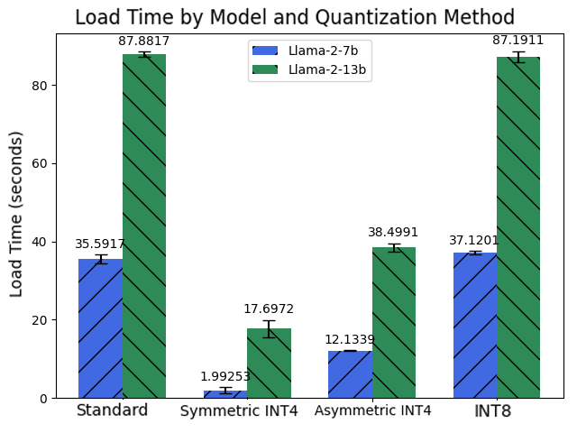

### C-Eval Test Result of LLaMA-2
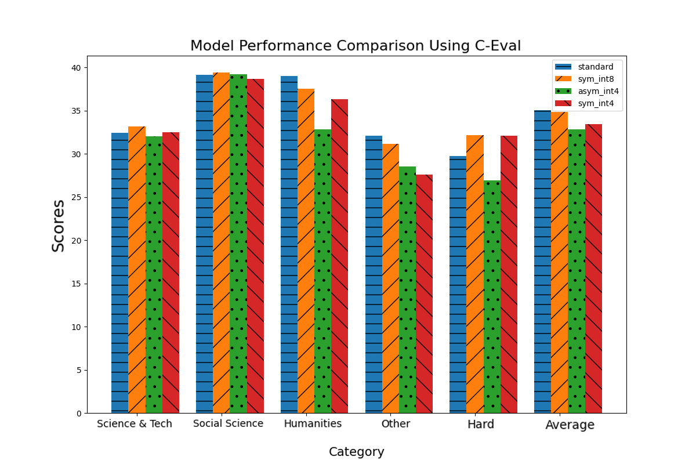

### System Response Latency with Different Input Lengths
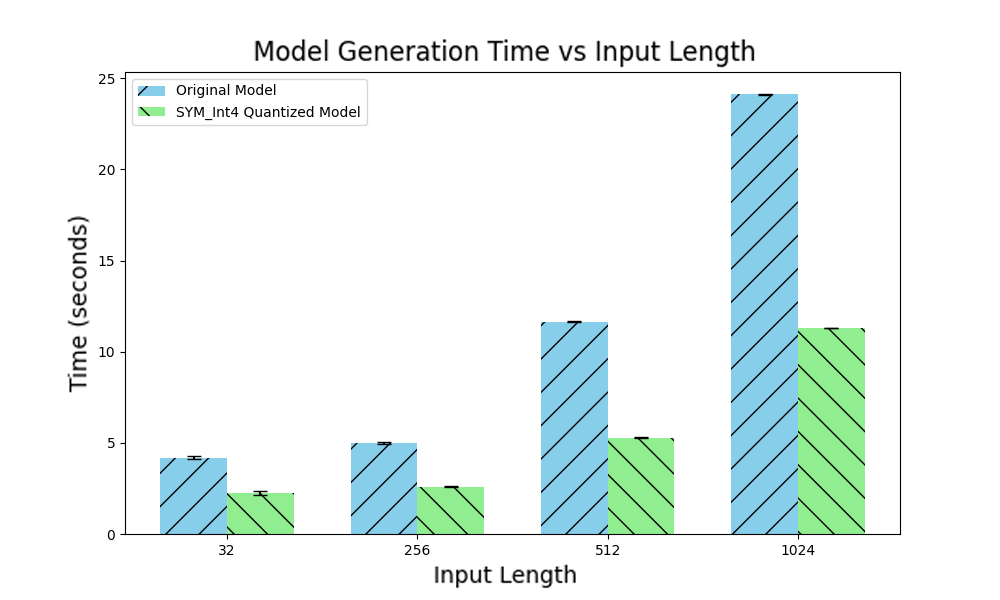

### System Concurrency Performance
In this experiment, the system's load balancing capability was compared using 1 and 2 worker pods.

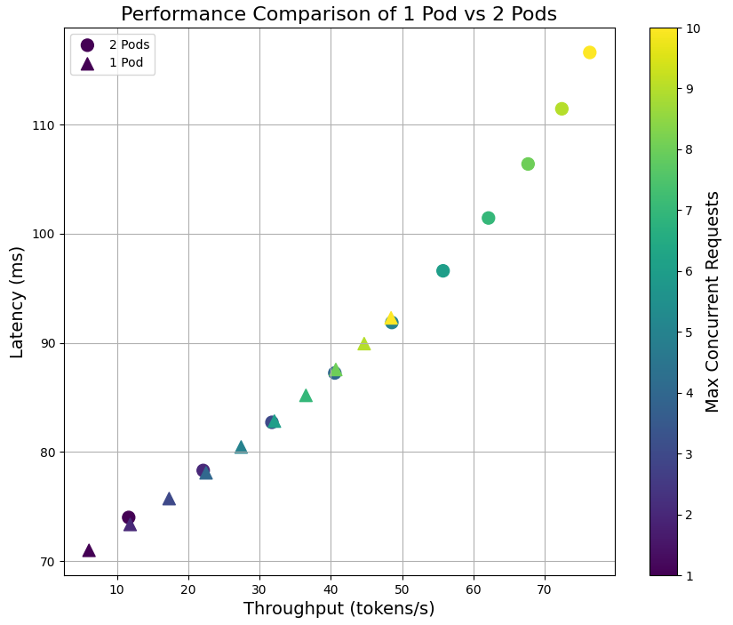
