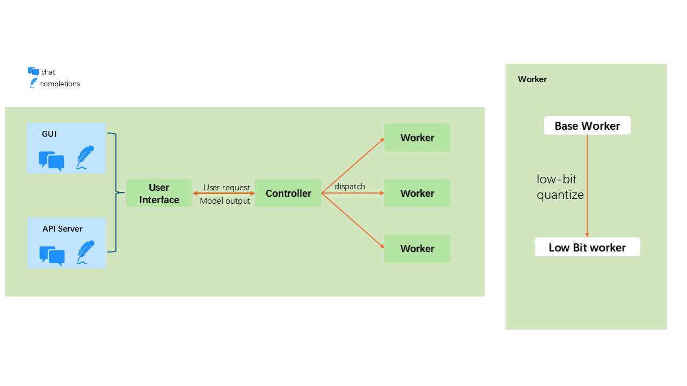

# SFBot
Secure Fast ChatBot with INT4 Quantization for `LLaMA-2` Chat Model

## Introduction
This repository provides a secure and efficient implementation of a chatbot using the LLaMA-2-7B-chat-hf model. Key features include:

* INT4 Quantization: Reduces model size and accelerates inference while maintaining high performance.
* Enhanced Security: Integrate the Intel TDX technology to ensure safe deployment and interaction.
* Optimized Performance: Leverages IPEX-LLM to enhance the speed and efficiency of the chat model.

## How to

### Overview
The below picture is the brief introduction about the Chat Bot system.

The system is based on [FastChat](https://github.com/lm-sys/FastChat) and further developed.

### System development

Use FastChat's base worker and GUI, develop the customization Low bit worker and API server

### Int4 low bit quantization
For the normal in model traning, we usually using float data format and it cause big space 开销

So we can using quantization to 减少开销

In this project, I using the int4 low-bit quantization

$$
X_{i4}=\left\lfloor{\frac{8 \cdot X_{f32}}{\underset{ij}{max} (|X_{f32_{ij}}|)}}\right\rceil + 8= 
  \left\lfloor{\frac{8}{{||X_{f32}||}_{\infty}} X_{f32}} \right\rceil + 8= 
  \left\lfloor{s_{x_{f_{32}}}} X_{f32}\right\rceil + 8
$$

$$
ndx_{f32}=\frac{15}{\underset{ij}{max}(X^{ij}_{f32})-\underset{ij}{min}(X^{ij}_{f32})}
$$

$$
zp_{xi32}=\left\lfloor ndx_{f32} \cdot \underset{ij}{min}(X^{ij}_{f32})\right\rceil
$$

$$
X_{i4} = \left\lfloor ndx_{f32} X_{f32}\right\rceil - zp_{xi32}$$